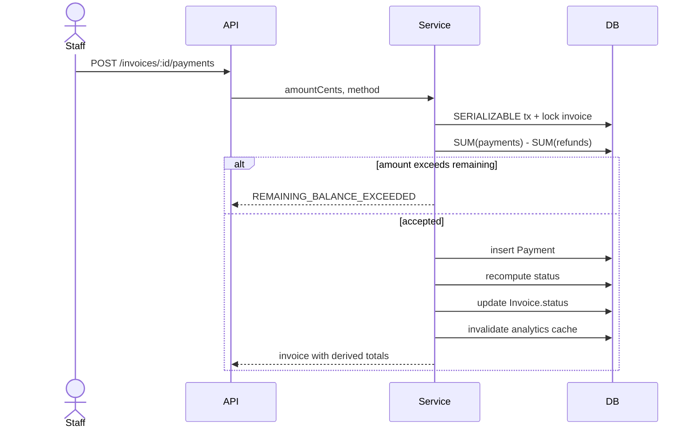
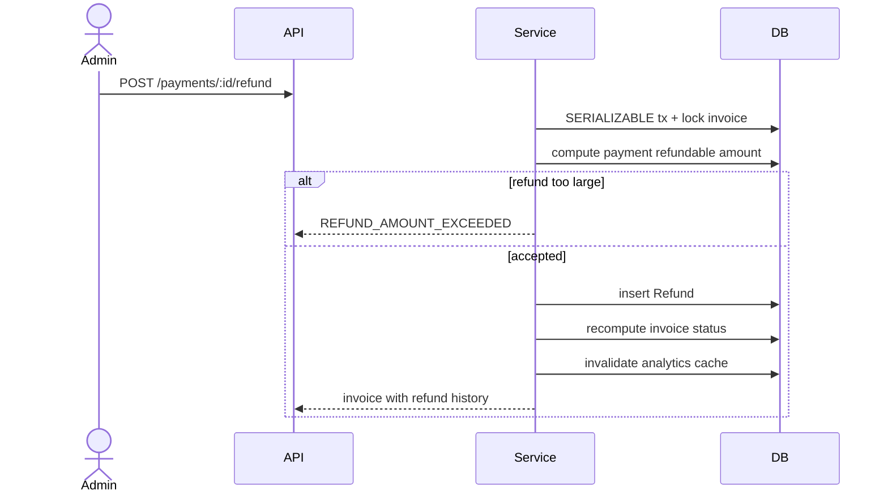
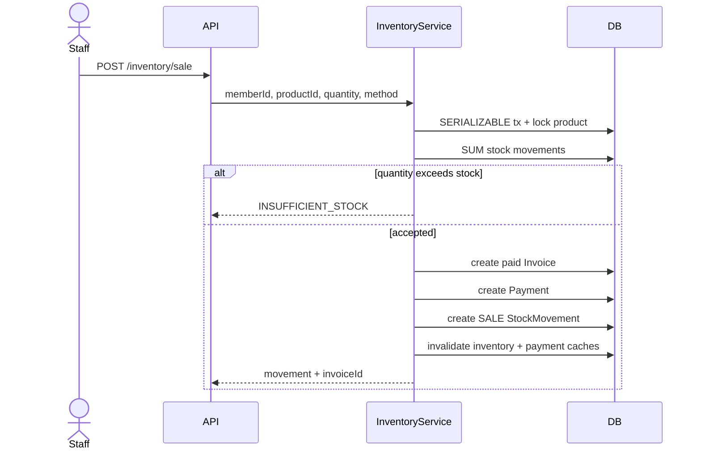
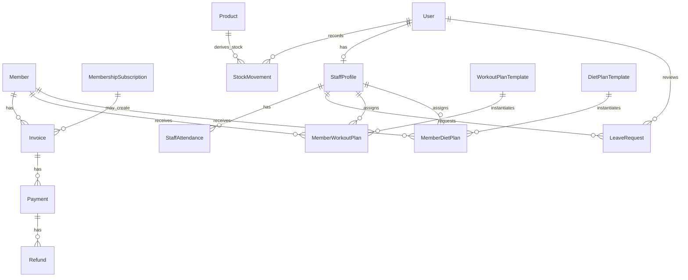

# Backend Batch 1

## Scope

Completes Payments, membership renewal/grace coupling, Gym Vault/Inventory, Staff, staff attendance, leave requests, workout templates/assignments, and diet templates/assignments.

## Core Invariants

- Invoice paid amount is derived from `Payment` minus `Refund`; `Invoice` has no paid-total column.
- Payment writes lock/recompute inside a serializable transaction and reject overpayment.
- Refunds are separate audited events and cannot exceed the refundable amount for a payment.
- Member check-in now requires an active subscription or a subscription inside plan `gracePeriodDays`.
- Product stock is derived from `SUM(StockMovement.quantityDelta)`.
- Inventory sales lock the product row, derive stock, reject oversell, then create stock movement plus invoice/payment rows.
- Staff attendance mirrors member attendance with one open row enforced by a partial unique index.

## Payment Flow

## Refund Flow

## Inventory Sale Flow

## ER Delta

