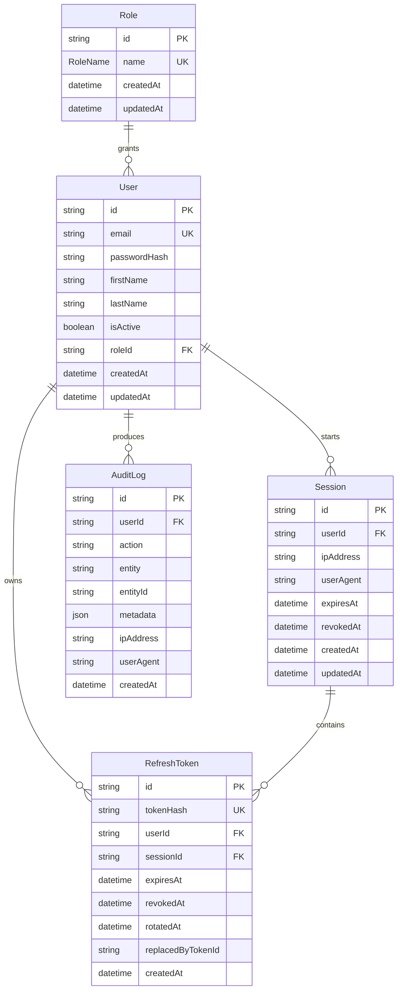
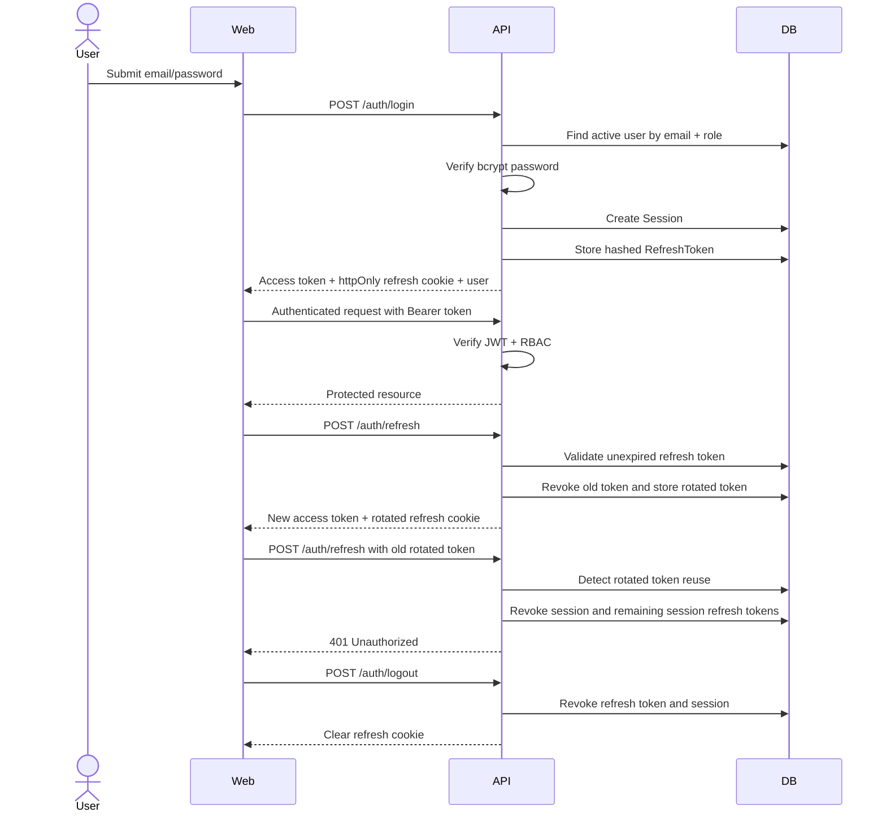

# Phase 0 - Foundations

## Architecture Choice

This project uses a monorepo:

- `apps/api`: Fastify API, Prisma schema, auth services, tests.
- `apps/web`: React/Vite frontend shell.
- `packages/shared`: shared DTOs and role contracts.

A monorepo is the right fit for a single-gym product built incrementally because API contracts, role names, auth payloads, Docker config, and frontend routes can change atomically in one codebase.

## Folder Structure

```text
.
├── apps
│   ├── api
│   │   ├── prisma
│   │   ├── src
│   │   │   ├── config
│   │   │   ├── controllers
│   │   │   ├── middlewares
│   │   │   ├── plugins
│   │   │   ├── repositories
│   │   │   ├── routes
│   │   │   ├── services
│   │   │   ├── types
│   │   │   └── utils
│   │   └── test
│   └── web
│       └── src
│           ├── app
│           ├── components
│           ├── features
│           ├── pages
│           ├── services
│           ├── store
│           ├── styles
│           └── types
├── packages
│   └── shared
└── docs
```

## ER Diagram



## Auth Sequence


