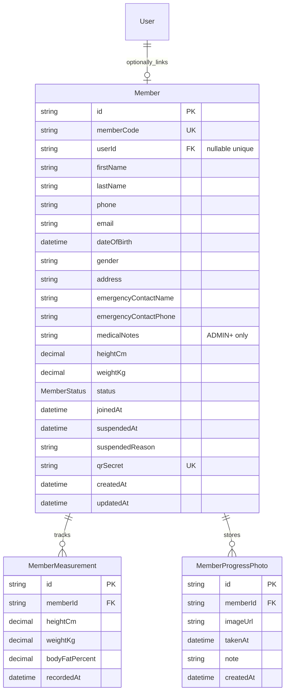

# Phase 1a - Member Core

## Scope

This sub-phase adds member profile management only. Attendance check-in/out, history, analytics, and Redis aggregate caching remain untouched until 1b/1c.

## Decisions

- Members may exist without login accounts. `Member.userId` is nullable and unique, so the front desk can create member records now and issue portal access later.
- Member codes are human-readable and sequence-backed, for example `GYM-000001`.
- QR payloads do not contain raw member IDs. Each member has a static, random `qrSecret` that can be regenerated to invalidate the previous code.
- BMI is derived from height and weight at read time and is not stored.
- `medicalNotes` is sensitive: ADMIN+ can read/write it, STAFF can create/update normal profile fields but does not receive medical notes in list/detail responses.

## Schema Diff

- Added `MemberStatus`: `ACTIVE`, `SUSPENDED`, `ARCHIVED`.
- Added `Member` with nullable unique `userId`, sequence-backed unique `memberCode`, regenerable unique `qrSecret`, lifecycle fields, body measurements, and sensitive `medicalNotes`.
- Added `MemberMeasurement` as an append-only measurement history table.
- Added `MemberProgressPhoto` for future ImgBB-backed photo records.
- Added optional `User.memberProfile` relation.

## Endpoints

| Method | Path | Access |
| --- | --- | --- |
| `POST` | `/members` | STAFF+; `medicalNotes` requires ADMIN+ |
| `GET` | `/members` | STAFF+; omits `medicalNotes` |
| `GET` | `/members/:id` | STAFF+ or linked member self; `medicalNotes` only ADMIN+ or self |
| `PATCH` | `/members/:id` | STAFF+; archived members blocked; `medicalNotes` requires ADMIN+ |
| `DELETE` | `/members/:id` | ADMIN+; soft archive only |
| `POST` | `/members/:id/suspend` | ADMIN+; reason required |
| `POST` | `/members/:id/restore` | ADMIN+; archived members cannot be restored |
| `GET` | `/members/:id/qr` | STAFF+ or linked member self |
| `POST` | `/members/:id/qr/regenerate` | ADMIN+; archived members blocked |

## ER Diagram Delta

## RBAC Notes

- STAFF, ADMIN, GYM_OWNER, and SUPER_ADMIN can create and view member profiles.
- STAFF can update normal profile fields but cannot suspend, restore, archive, or read/write medical notes.
- ADMIN, GYM_OWNER, and SUPER_ADMIN can suspend, restore, archive, regenerate QR secrets, and manage medical notes.
- MEMBER users can view their own linked member profile, including their own medical notes.
