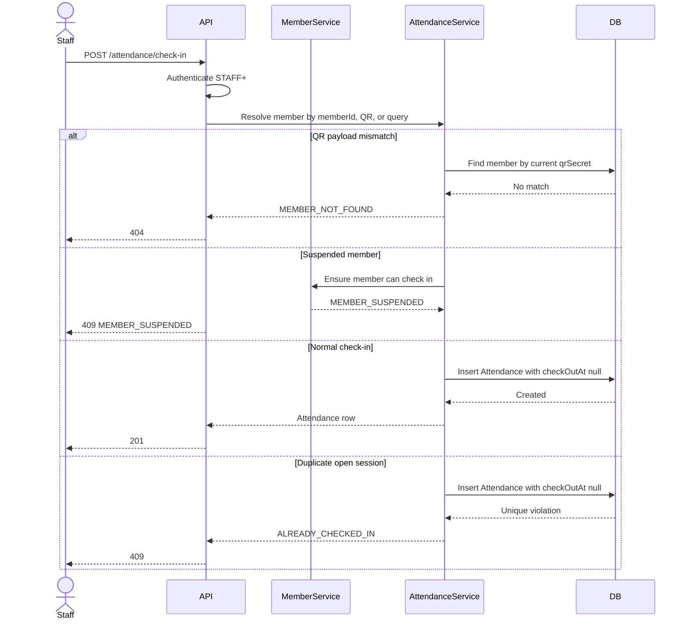
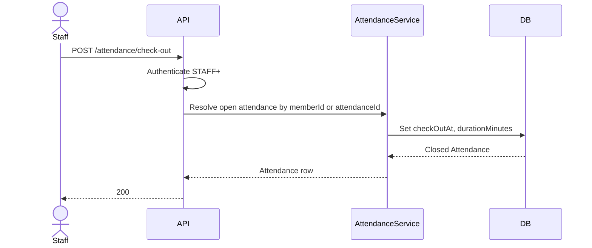

# Phase 1b - Attendance Check-In / Check-Out

## Scope

This sub-phase adds front-desk attendance operations on top of Phase 1a members. Self-service kiosk mode is deferred, so every check-in/out endpoint requires an authenticated STAFF+ actor.

## Schema Diff

- Added `CheckInMethod`: `QR`, `MEMBER_ID`, `USERNAME_SEARCH`.
- Added `Attendance` with `memberId`, `checkInAt`, nullable `checkOutAt`, `checkInMethod`, nullable `checkedInBy`, nullable stored `durationMinutes`, and `autoClosed`.
- Added a Postgres partial unique index:

```sql
CREATE UNIQUE INDEX attendance_one_open_session_per_member
ON "Attendance" ("memberId")
WHERE "checkOutAt" IS NULL;
```

## Check-In Sequence



## Check-Out Sequence



## Auto-Checkout Job

The API process schedules `autoCloseStaleAttendances()` every 15 minutes. It closes open sessions older than 12 hours at exactly `checkInAt + 12h`, stores the computed duration, and sets `autoClosed = true`.

## Reporting Date Rule

`getAttendanceForDate(date)` filters by `checkInAt` within that day's UTC range. Overnight sessions are attributed to their check-in date and are not split in this phase.
