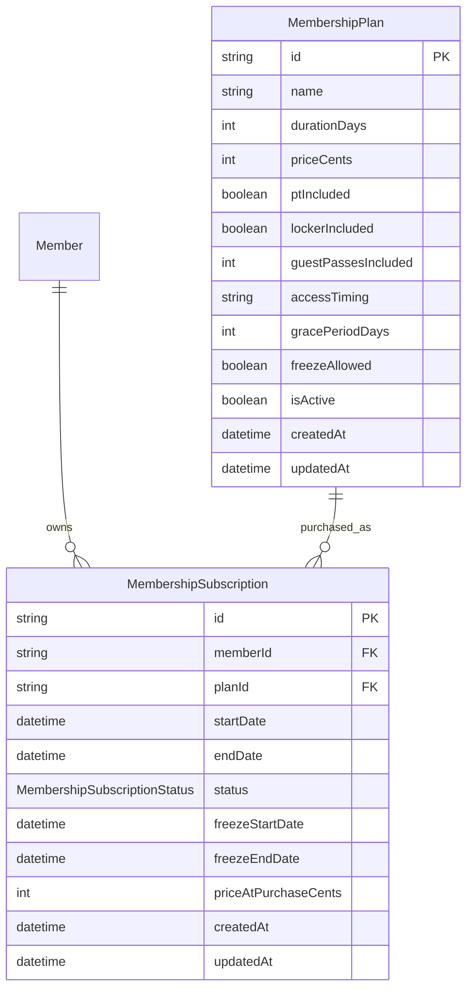

# Phase 2a - Membership Plans + Subscriptions

## Scope

This sub-phase adds membership configuration and member subscription history. Payments, receipts, renewals, expiry jobs, grace-period check-in enforcement, and reminders remain for 2b/2c.

## Decisions

- Money is stored as integer cents in `priceCents` and `priceAtPurchaseCents`.
- Plan access timing is free text for now; check-in enforcement is out of scope.
- Freeze support is explicit via `MembershipPlan.freezeAllowed`.
- Only one freeze is allowed per subscription. Unfreezing shifts `endDate` forward by the frozen duration.
- Assigning a plan creates a new subscription row and snapshots the current plan price. Existing subscription dates are not mutated; if an existing `ACTIVE` subscription has already ended before the new start date, it is marked `EXPIRED` before the new row is created.

## Schema Diff

- Added `MembershipSubscriptionStatus`: `ACTIVE`, `EXPIRED`, `FROZEN`, `CANCELLED`.
- Added `MembershipPlan`.
- Added `MembershipSubscription`.
- Added `Member.subscriptions` relation.
- Added Postgres partial unique index:

```sql
CREATE UNIQUE INDEX membership_one_active_subscription_per_member
ON "MembershipSubscription" ("memberId")
WHERE "status" = 'ACTIVE';
```

## ER Diagram Delta



## Endpoints

| Method | Path | Access |
| --- | --- | --- |
| `POST` | `/membership-plans` | ADMIN+ |
| `GET` | `/membership-plans` | ADMIN+ |
| `PATCH` | `/membership-plans/:id` | ADMIN+ |
| `POST` | `/membership-plans/:id/deactivate` | ADMIN+ |
| `POST` | `/members/:id/subscriptions` | ADMIN+ |
| `GET` | `/members/:id/subscriptions` | STAFF+ or linked MEMBER self |
| `POST` | `/members/:id/subscriptions/:subId/freeze` | ADMIN+ |
| `POST` | `/members/:id/subscriptions/:subId/unfreeze` | ADMIN+ |
