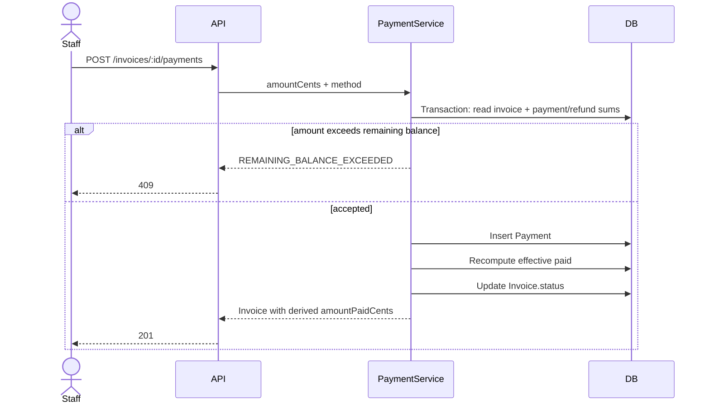
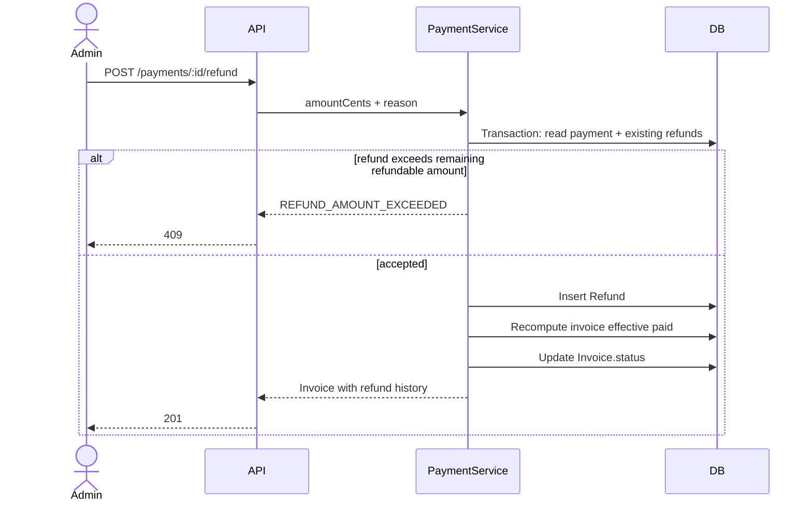

# Phase 2b - Payments

## Scope

This sub-phase adds invoices, payments, refunds, receipts, member payment history, and cached payment analytics. Renewals, expiry jobs, grace-period enforcement, and reminders remain for 2c.

## Schema Diff

- Added `InvoiceStatus`: `PENDING`, `PARTIALLY_PAID`, `PAID`, `REFUNDED`, `CANCELLED`.
- Added `PaymentMethod`: `CASH`, `UPI`, `CARD`, `ONLINE`.
- Added `Invoice` with `amountDueCents` and no mutable paid-total column.
- Added `Payment` as immutable payment events.
- Added `Refund` as separate auditable refund events.

## Money Invariant

Effective paid amount is always derived as:

```text
sum(Payment.amountCents) - sum(Refund.amountCents)
```

Overpayment is rejected. All money values are integer cents.

## Partial Payment Sequence



## Refund Sequence



## Cache

Payment analytics uses cache-aside with 5-minute TTL and explicit invalidation on payment/refund writes.

Key shape:

- `payments:analytics:{range}`
